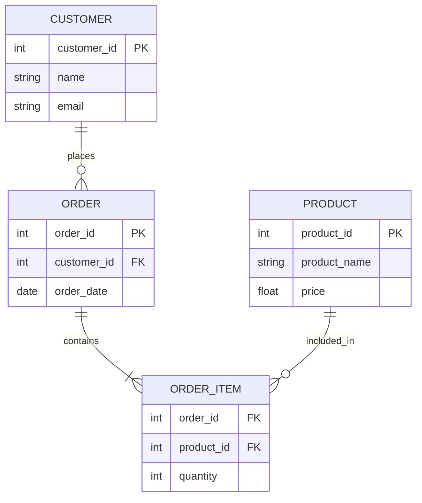

# Desain Konseptual Database: Panduan Komprehensif ERD

Sebelum satu baris kode SQL ditulis, sebuah database harus dirancang di atas kertas. Tahap ini disebut **Desain Konseptual**. Alat utama yang digunakan adalah **Entity Relationship Diagram (ERD)**.

Bayangkan ERD sebagai "cetak biru" (blueprint) arsitek sebelum membangun gedung. Tanpa cetak biru, pondasi akan rapuh dan ruangan mungkin tidak terhubung dengan benar.

## 1\. Anatomi ERD (Komponen Utama)

ERD terdiri dari tiga elemen dasar yang merepresentasikan data dan aturan bisnis:

### A. Entitas (Entity)

Objek dunia nyata (baik fisik maupun abstrak) yang datanya ingin kita simpan. Dalam database, ini nantinya akan menjadi **Tabel**.

* **Contoh:** `Mahasiswa`, `Barang`, `Transaksi`, `Dosen`.
* **Simbol:** Persegi Panjang.
* **Jenis:**
  * *Strong Entity:* Berdiri sendiri (misal: Karyawan).
  * *Weak Entity:* Bergantung pada entitas lain (misal: Tunjangan Karyawan - tidak ada tunjangan jika tidak ada karyawan).

### B. Atribut (Attribute)

Karakteristik atau properti yang mendeskripsikan suatu entitas. Nantinya ini akan menjadi **Kolom**.

* **Simbol:** Oval (dalam notasi Chen) atau daftar list di dalam kotak entitas (dalam notasi Crow's Foot).
* **Jenis-jenis Atribut:**
  * **Key Attribute (Primary Key):** Atribut unik yang membedakan satu baris data dengan yang lain (misal: `NIM`, `Nomor_Resi`).
  * **Composite Attribute:** Atribut yang bisa dipecah lagi (misal: `Alamat` bisa dipecah menjadi `Jalan`, `Kota`, `Kode Pos`).
  * **Derived Attribute:** Nilai yang tidak disimpan langsung, tapi dihitung dari atribut lain (misal: `Umur` dihitung dari `Tanggal_Lahir`).

### C. Relasi (Relationship)

Hubungan logis antara dua entitas atau lebih.

* **Contoh:** Mahasiswa *Mengambil* Mata Kuliah; Pelanggan *Membeli* Produk.
* **Simbol:** Belah Ketupat (Diamond) atau garis penghubung.

-----

## 2\. Kunci (Keys)

Salah satu bagian terpenting yang sering terlewatkan di materi dasar adalah konsep *Keys*.

1. **Primary Key (PK):** Tanda pengenal unik. Tidak boleh ada dua data dengan PK yang sama.
      * *Contoh:* Tidak boleh ada 2 mahasiswa dengan NIM '12345'.
2. **Foreign Key (FK):** Atribut yang merujuk ke Primary Key di entitas lain untuk menciptakan hubungan.
      * *Contoh:* Di tabel `Pesanan`, terdapat kolom `ID_Pelanggan` (FK) yang merujuk ke `ID_Pelanggan` di tabel `Pelanggan`.

-----

## 3\. Kardinalitas & Notasi (Aturan Bisnis)

Kardinalitas menjelaskan **berapa banyak** interaksi yang terjadi antara entitas A dan entitas B.

| Tipe Relasi | Penjelasan | Contoh Nyata |
| :--- | :--- | :--- |
| **One-to-One (1:1)** | Satu baris di A hanya berhubungan dengan satu baris di B. | **Suami - Istri** (Dalam hukum monogami), atau **CEO - Perusahaan**. |
| **One-to-Many (1:N)** | Satu baris di A berhubungan dengan banyak baris di B, tapi B hanya ke satu A. | **Ibu - Anak Kandung**. Satu ibu bisa punya banyak anak, tapi anak hanya punya satu ibu kandung. |
| **Many-to-Many (M:N)** | Banyak baris di A berhubungan dengan banyak baris di B. | **Mahasiswa - Mata Kuliah**. Satu mahasiswa ambil banyak matkul, satu matkul diambil banyak mahasiswa. |

> **⚠️ Catatan Penting:** Dalam implementasi database fisik, relasi **Many-to-Many (M:N)** tidak bisa dibuat langsung. Kita harus memecahnya menggunakan tabel perantara (*Junction Table*).

-----

## 4\. Studi Kasus: Sistem Toko Online (E-Commerce)

Mari kita buat ERD sederhana untuk Toko Online untuk melihat bagaimana semua komponen bekerja sama.

**Skenario:**

1. **Pelanggan** (Customer) melakukan **Pesanan** (Order).
2. Satu Pelanggan bisa membuat banyak Pesanan (1:N).
3. Setiap Pesanan berisi banyak **Produk**.
4. Satu Produk bisa ada di banyak Pesanan (M:N).

**Visualisasi ERD (Menggunakan Mermaid Syntax):**

**Penjelasan Diagram di atas:**

* **CUSTOMER ke ORDER (1:N):** Garis `||--o{` menunjukkan satu customer bisa punya 0 atau banyak order.
* **ORDER ke PRODUCT (M:N diselesaikan):** Perhatikan ada entitas tengah bernama `ORDER_ITEM`. Ini memecah hubungan *Many-to-Many* antara Order dan Product. Tabel ini menyimpan detail seperti "Berapa buah (quantity) produk X yang dibeli di Order Y?".

-----

## 5\. Mengapa Desain Konseptual Sangat Krusial?

1. **Efisiensi Biaya:** Memperbaiki kesalahan di tahap gambar (ERD) itu gratis. Memperbaiki kesalahan setelah database terisi ribuan data membutuhkan migrasi yang rumit, *downtime* sistem, dan biaya besar.
2. **Komunikasi:** ERD adalah bahasa universal antara *developer* (orang teknis) dan *klien/manajer* (orang non-teknis) untuk menyepakati aturan bisnis.
3. **Mencegah Redundansi:** ERD yang baik membantu kita melihat duplikasi data sejak awal (Normalisasi).

### Langkah Selanjutnya?

Setelah Desain Konseptual (ERD) selesai, tahap berikutnya adalah **Desain Logis** (menentukan tipe data spesifik seperti `VARCHAR`, `INT`, `DECIMAL`) dan akhirnya **Desain Fisik** (menulis kode `CREATE TABLE` di SQL).
